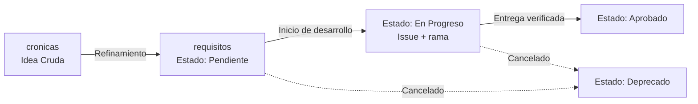

# Manual de Gobernanza de la Documentación — Nova TIC-ON

Este manual adapta el método **DOMER** (Documentación Organizada, Metódica, Evolutiva y Rastreable) al proyecto **Nova TIC-ON**. Toma como referencia `gobernanza-domer-software.md` del repositorio `cronicas-de-un-ingeniero` y lo reduce al alcance real de este proyecto: una **propuesta web de la XI Feria TIC-ON del SENA**.

El objetivo es el mismo que el de DOMER pero a escala académica: que ninguna decisión que vaya a importar dentro de un año se quede solo en la cabeza de quien la tomó hoy. Cada nota responde a una sola pregunta: _¿por qué se decidió esto?_ El qué técnico se resuelve en el código (`desk/`); la referencia a ese código se documenta con los enlaces de Obsidian.

La metodología usa **Obsidian** como herramienta de lectura y **GitHub** como repositorio. Prioriza la trazabilidad del _porqué_ por encima de la documentación estática.

> **Nota de alcance:** este proyecto no genera artefactos de build (por decisión, ver `adr-2`), por lo que este manual no contempla un directorio `build/` como lo hace DOMER. Todo lo que responde al _porqué_ vive aquí; todo lo derivable del código vive en `desk/`.

---

## 1. Segmentación del repositorio

```text
nova-ticon/
├── _docs_nova-ticon/    # Fuente de verdad de la gobernanza (visión, dominios, ADR, requisitos).
├── desk/                # Software: propuesta web (HTML, assets, componentes y estilos).
├── cronicas/            # Bitácoras del proceso (captura libre, sin formato).
└── .obsidian/           # Configuración del vault Obsidian.
```

**Regla de frontera `_docs_nova-ticon/` vs `desk/`:**

> Si alguien tuvo que decidir conscientemente algo, pertenece a `_docs_nova-ticon/`. Si se puede derivar o regenerar desde el código, pertenece a `desk/`.

El directorio `cronicas/` es el equivalente al `00_Inbox/` de DOMER: captura libre de ideas, feedback y conclusiones de reunión, sin estructura obligatoria.

---

## 2. Estructura del directorio (`_docs_nova-ticon/`)

```text
_docs_nova-ticon/
├── adr/               # Decisiones de Arquitectura (ADR). Único tipo de decisión técnica.
├── vision/            # La identidad del producto.
│   ├── va-*.md        # La Visión Activa (VA).
│   └── dominio/       # Documentos de Dominio (identidad de un pilar).
├── requisitos/        # Requisitos (REQ-XXX): la unidad de valor del sistema.
└── GOBERNANZA.md      # Este manual.
```

**Reglas de uso:**

- `cronicas/` no requiere estructura; ahí se vuelca cualquier pensamiento.
- Todo lo que vive en `vision/` nace directamente ahí. El resto de las notas nace en `cronicas/`.
- `adr/`, `vision/` y `requisitos/` solo contienen notas con frontmatter válido según la sección 4.
- En este manual, `_Archive/` no existe todavía; cuando un ADR se supere o un REQ del MVP se deprecie, se crea con la política de la sección 11.

---

## 3. Jerarquía general del sistema

```text
Visión Activa (VA)  ── 1 ──────────► N  ADR   (decisión técnica)
                                             │
                                           1 ──────► N  REQ   (unidad de valor)
```

- **VA → ADR** es 1:N. Cada ADR tiene exactamente una `vision_origen`.
- **ADR → REQ** es 1:N. Cada REQ tiene exactamente un `origen`: un ADR.
- El **REQ es la unidad de valor**: la nota más pequeña que este manual obliga a rastrear hasta producción.
- Los **documentos de Dominio** (`vision/dominio/`) no son un nivel de esta jerarquía: son material de identidad que un ADR cita por nombre en su campo `dominio` cuando varios ADR comparten el mismo paradigma.
- **Feature no es un tipo de nota gobernado.** Conserva su significado habitual de la industria. La planeación de bajo nivel para construir una pieza de un REQ puede anotarse como andamio temporal en `cronicas/`.

---

## 4. Estándar de Metadatos (Propiedades Frontmatter)

Los ids se escriben en minúsculas y con guiones, alineados con la convención existente del proyecto (`adr-1`, `va-nova-ticon-1`).

### 4.1 Visión Activa (`vision/va-<slug>.md`)

```yaml
---
tipo: vision
id: va-nova-ticon-1
estado: Borrador          # Borrador | Activa | Superada
naturaleza:               # libre, opcional — p.ej. Propuesta académica
---
```

**Cuerpo mínimo para `estado: Activa`:** qué es y cómo se usa, qué no es, y opcionalmente alternativas cercanas.

### 4.2 Documento de Dominio (`vision/dominio/<dominio>.md`)

```yaml
---
tipo: dominio
dominio: "Sistema de diseño TIC-ON"   # nombre del dominio; funciona como identificador
estado: Propuesto         # Propuesto | En Delimitación | Delimitado
vision_origen: va-nova-ticon-1
---
```

**Estados:**

- **Propuesto:** se identificó que este dominio va a sostener más de una decisión técnica, pero no se delimita.
- **En Delimitación:** se está redactando qué es y qué no es dentro del producto.
- **Delimitado:** distingue con claridad el pilar; los ADR pueden apoyarse en él con confianza.

Se crea solo cuando un dominio va a sostener más de un ADR. **Cuerpo mínimo para `Delimitado`:** qué es dentro del producto, qué no es.

### 4.3 Decisión de Arquitectura (`adr/adr-<n>.md`)

```yaml
---
tipo: adr
id: adr-2
estado: Propuesto          # Propuesto | Aceptada | Superada
nombre: Título brevisimo de la decisión.
descripcion: Una línea sobre qué resuelve.
vision_origen: va-nova-ticon-1
dominio: "Nombre del pilar"   # obligatorio; enlaza al documento de Dominio si existe
reemplaza:
superado_por:
requisitos_derivados:
  - req-1
rama: "adr/adr-2-descripcion"   # opcional
---
```

Cada ADR resuelve **paradigma y tecnología en el mismo documento**: abre con **Contexto** (el método, el porqué de la forma elegida) antes de la decisión técnica concreta. Cuando el contexto ya está delimitado en un documento de Dominio, el ADR se remite a él.

### 4.4 Requisito (`requisitos/req-<n>.md`)

```yaml
---
tipo: requisito
id: req-1
estado: Pendiente          # Pendiente | En Progreso | Aprobado | Deprecado
prioridad: Alta            # Crítica | Alta | Media | Baja
origen: adr-2
responsable: "@equipo"
sprint:                   # opcional
rama:                     # opcional
---
```

**Estados:**

- **Pendiente:** refinado, listo para desarrollarse.
- **En Progreso:** hay un Issue/PR activo.
- **Aprobado:** el PR fue fusionado en `main` y los criterios están verificados.
- **Deprecado:** cancelado o reemplazado; se procesa según la política de conservación (sección 11).

---

## 5. Definición de Listo (DoR) y Definición de Hecho (DoD)

### 5.1 VA
**DoR para `Activa`:** contiene "qué es", "qué no es" y, opcionalmente, alternativas. No tiene DoD; se supera cuando otra VA la reemplaza.

### 5.2 Documento de Dominio
**DoR para `Delimitado`:** `vision_origen` apunta a una VA Activa; contiene qué es y qué no es el dominio. No tiene DoD formal; se edita cuando el pilar evoluciona.

### 5.3 ADR
**DoR:** `vision_origen` apunta a una VA Activa; sección de Contexto redactada; al menos una alternativa evaluada. **DoD (`Aceptada`):** discusión de equipo sin objeciones abiertas.

### 5.4 REQ
**DoR:** título descriptivo, actor identificado, al menos un párrafo en "El Por Qué", `origen`, criterios de aceptación esbozados. **DoD (`Aprobado`):** entrega fusionada/verificada y criterios de aceptación cumplidos.

---

## 6. Anatomía de una nota de Requisito

```markdown
# [req-XXX] Nombre Descriptivo del Requisito

## 🎯 1. El "Por Qué"
*¿Qué problema resuelve? ¿Por qué es necesario ahora?*

## 👥 2. Actores y Alcance
*¿Quién interactúa? ¿Qué queda explícitamente fuera?*

## 📋 3. Criterios de Aceptación
- [ ] Dado que [contexto inicial], cuando [acción], entonces [resultado esperado].

## 🔗 4. Trazabilidad
*   **Origen:** [[adr-XXX]]
*   **Decisiones relacionadas:** [[adr-YYY]]
*   **Implementación:** [[desk/index.html]] y páginas hermanas
```

---

## 7. Ciclo de Vida de una Nota



1. **Captura:** cualquier persona anota en `cronicas/`. No se exige formato.
2. **Refinamiento:** las notas que cumplen su DoR reciben un id único y pasan a su carpeta con estado inicial `Propuesto`/`Pendiente`.
3. **Desarrollo:** el trabajo sobre un REQ marca `En Progreso` y abre un Issue/rama.
4. **Consolidación:** al verificar la entrega, el REQ pasa a `Aprobado` y sus criterios se marcan.
5. **Deprecación:** un REQ irrelevante pasa a `Deprecado`; un ADR superado a `Superado` con `superado_por` enlazado.

---

## 8. Integración con Git

### 8.1 Convención de nombres de rama

|Tipo|Formato|Propósito|
|---|---|---|
|`feature/`|`feature/req-XXX-<descripción>`|Desarrollo de un requisito.|
|`adr/`|`adr/adr-XXX-<descripción>`|Discusión de una decisión de arquitectura.|
|`hotfix/`|`hotfix/<descripción>`|Corrección urgente sobre `main`.|
|`main`|`main`|Entrega de referencia.|

**Reglas:**

- Toda rama `feature/` debe tener un REQ asociado en `Pendiente` o `En Progreso`. Al crear la rama, se añade su nombre al campo `rama`.
- Al fusionar, el REQ pasa a `Aprobado` y se completa su DoD.
- Un ADR se trata como discusión de decisión: se fusiona su rama cuando el ADR pasa a `Aceptada`.
- No se fuerza un GitFlow estricto; este proyecto es liviano. La convención existe para que el día que el equipo crezca, el hábito ya esté plantado.

---

## 9. Cuadro de Mando (Obsidian Dataview)

```dataview
TABLE estado AS "Estado", naturaleza AS "Naturaleza"
FROM "_docs_nova-ticon/vision"
WHERE tipo = "vision" AND estado = "Activa"
```

```dataview
TABLE estado AS "Estado", vision_origen AS "Visión"
FROM "_docs_nova-ticon/vision/dominio"
WHERE tipo = "dominio"
```

```dataview
TABLE dominio AS "Dominio", estado AS "Estado"
FROM "_docs_nova-ticon/adr"
WHERE tipo = "adr"
```

```dataview
TABLE prioridad AS "Prioridad", origen AS "Origen", estado AS "Estado"
FROM "_docs_nova-ticon/requisitos"
WHERE tipo = "requisito"
SORT prioridad ASC
```

---

## 10. Mantenimiento y Evolución

- Este manual se versiona junto con el código; cualquier cambio de metodología se refleja aquí.
- Las notas con frontmatter son el punto único de verdad del formato.
- Cuando un ADR se supera, se revisa el campo `origen` de los REQ que apuntaban a él y se actualiza.
- Este manual se revisa al final de cada entrega (sprint/trimestre académico).

---

## 11. Política de Conservación

- **VA:** se versiona con Git, no se archiva. Si evoluciona, se crea una nueva nota y la anterior queda en el historial.
- **Documentos de Dominio:** mismo tratamiento que la VA: se editan y quedan versionados.
- **ADR:** se conservan siempre, incluso superados. Los superados se mueven a `_Archive/` con `superado_por` enlazado. No se eliminan.
- **REQ:** un REQ vigente nunca se elimina del activo. Al deprecarse, los del MVP se mueven a `_Archive/`; el resto se elimina del vault.
- **`cronicas/` (Inbox):** se puede limpiar libremente tras el refinamiento; lo importante ya migró a su carpeta.

---

## 12. Estado actual de la documentación

|Nota|Id|Estado|Ruta|
|---|---|---|---|
|Manual de gobernanza|GOB-NOVA-TICON|v1.0.0|`_docs_nova-ticon/GOBERNANZA.md`|
|Visión Activa — propuesta web|va-nova-ticon-1|Activa|`_docs_nova-ticon/vision/va-nova-ticon-1.md`|
|Dominio — Sistema de diseño TIC-ON|Sistema de diseño TIC-ON|Delimitado|`_docs_nova-ticon/vision/dominio/concepto-desing.md`|
|Stack tecnológico web|adr-1|Aceptada|`_docs_nova-ticon/adr/adr-1.md`|
|Propuesta web multi-página|adr-2|Aceptada|`_docs_nova-ticon/adr/adr-2-propuesta-web.md`|
|Páginas de la propuesta web|req-1|En Progreso|`_docs_nova-ticon/requisitos/req-1-paginas-web.md`|